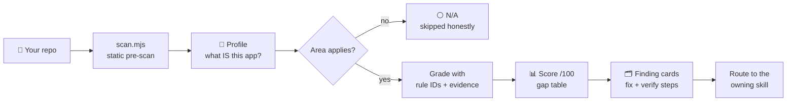

<div align="center">

# 🩺 Vibe Check

### Your app runs. But does it survive real users?

**A linter-grade production-readiness audit for vibe-coded (AI-generated) apps — packaged as 19 Claude Code skills.**

[](CHANGELOG.md)
[](#-the-skills)
[](LICENSE)
[](https://code.claude.com/docs/en/plugins)
[](skills/audit/scripts/scan.mjs)

*AI tools get you an app that runs in a weekend. This gets it through its first thousand users.*

</div>

---

## Why

AI generators optimize for **"works on my screen"** — a front-end and a database. Production needs a
dozen more layers: security, auth, scaling, observability, deployment safety, recovery, compliance.
The gap is invisible until launch day, and then it's expensive.

**Vibe Check finds the gap before your users do:**

- 🧠 **Adaptive** — profiles what your app actually *is* and skips what doesn't apply. A landing page and a multi-tenant SaaS get different audits.
- 🔍 **Evidence-based** — every finding cites `file:line` and a stable rule ID, or it's downgraded to "verify". No vibes-based auditing.
- 🛠️ **Actionable** — every gap becomes a finding card with a time-boxed fix in real commands, and a verify step to prove it landed.
- 🟢 **Honest** — a mature codebase gets the green report it deserves. No manufactured nitpicks.

## Install

```text
/plugin marketplace add hossein-webdev/vibe-check
/plugin install vibe-check@vibe-check-marketplace
```

Restart Claude Code (or run `/plugin`). Skills live under the `vibe-check:` namespace.

<details>
<summary><b>Manual install</b> (no plugin system)</summary>

<br>

Copy the folders in [`skills/`](skills/) into `~/.claude/skills/` (global) or your project's
`.claude/skills/`. Each skill is a standalone `SKILL.md`.

</details>

## Use

```text
/vibe-check:audit
```

…or just talk: *"is my app ready to launch?"* · *"someone could steal my API keys?"* ·
*"it froze when 50 people signed up"* — the matching skill activates on its own.

### What you get back

```text
# Vibe Check — myapp
Profile:   Next.js · Postgres/Drizzle · OTP auth · AI workers · gateway payments · PaaS
Readiness: 74/100 (Risky) · 1×P1 · 1×P2 · 3×Verify · 1×Light · 3×N/A

## Gap table
| Section (skill)      | Status   | Rule      | What you're missing                   | Priority | Evidence                    |
|----------------------|----------|-----------|---------------------------------------|----------|-----------------------------|
| monetization-pricing | 🔴 Gap   | PAY-04    | Callback returns 200 on failed charge | P1       | api/payments/callback.ts:88 |
| deployment-cicd      | 🟠 Gap   | DEPLOY-04 | `build` not run in CI                 | P2       | .github/workflows/ci.yml    |
| observability        | 🟢 Solid | —         | structured + correlated logs          | —        | platform/logger.ts:46       |
| auth-access          | ⚪ N/A   | —         | (no accounts in this app)             | —        | —                           |

## Findings
### [PAY-04] Failed charges acknowledged as success      Severity: P1 · Confidence: Confirmed
Where:    api/payments/callback.ts:88
Why it matters: the provider sees 200, never retries — failed payments vanish while dashboards stay green.
Fix (30 min): return non-2xx on failure OR push the raw event to a dead-letter queue; reconcile daily.
Verify:   simulate a failed charge → event lands in DLQ / provider retries; payments-per-hour alert fires.

Bottom line: fix the webhook failure path first — it silently eats revenue.
```

Re-run after fixing and the report leads with the drift: `Fixed: 2 · New: 0 · Remaining: 1 · Score: 74 → 91`.

## How it works



1. **Scan** — a bundled [static scanner](skills/audit/scripts/scan.mjs) (Node ≥18, zero deps, read-only) collects the mechanical facts: tracked `.env` files, secret-pattern hits, framework/DB/auth/AI/payment dependency classes, routes, workers, CI, tests, migrations.
2. **Profile** — an aspect-detection matrix identifies rendering model, serverless, monorepo, auth style, where AI is called, hosting platform, maturity. Adaptive rules kick in: *serverless → pooling emphasis · monorepo → per-app audits · hand-rolled auth → strictest checks · client-side LLM call → automatic P1.*
3. **Grade** — every applicable area is checked against its skill's rules. Scanner output is treated as **facts, not findings** — each hit is verified in source before it's reported (a test-DB URL in CI is fine; a live key in a component is not).
4. **Report** — readiness score, prioritized gap table, and a detailed finding card per gap.

### Scoring

| Score | Band | Meaning |
|:---:|:---:|---|
| 80–100 | 🟢 **Solid** | Ship — keep the verify list |
| 50–79 | 🟠 **Risky** | Fix P1/P2 before real users or money |
| 0–49 | 🔴 **Ship-blocker** | Do not launch until P1s are closed |

*P1 −25 · P2 −10 · Verify −3 · Light −1, from 100. P1 = leaks data, loses money, bypasses auth, or loses data.*

## 🧰 The skills

The `audit` router + 18 focused skills. Every rule ID is defined once, in its owning skill, with a
fix playbook — the audit cites them; you can also invoke any skill directly (`/vibe-check:app-security`).

| Skill | Covers | Rules |
|---|---|:---:|
| 🩺 **[`audit`](skills/audit/SKILL.md)** | The scored, adaptive audit — start here | — |
| 🏁 [`production-readiness`](skills/production-readiness/SKILL.md) | The last mile: 2-of-13-layers gap, owning AI code, docs, stage fit | `PROD` |
| 🛡️ [`app-security`](skills/app-security/SKILL.md) | RLS, service-role bypass, deps, headers, XSS, monoculture, AI supply chain | `SEC` |
| 🔑 [`secrets-management`](skills/secrets-management/SKILL.md) | Client-exposed keys, vaults, rotation, git history | `SEC-01..03` |
| 🚪 [`auth-access`](skills/auth-access/SKILL.md) | AuthN ≠ authZ, JWT, sessions, RBAC, tenant isolation | `AUTH` |
| 📈 [`scaling-performance`](skills/scaling-performance/SKILL.md) | The scaling decision tree, pooling, caching, background jobs | `SCALE` |
| 🗄️ [`data-architecture`](skills/data-architecture/SKILL.md) | Schema, tenancy, migrations/backups, storage, CRDTs | `DATA` |
| ⚖️ [`database-selection`](skills/database-selection/SKILL.md) | Platform by workload: Neon / PlanetScale / D1 / Supabase / Firebase / Convex | `DBS` |
| 🤖 [`ai-engineering`](skills/ai-engineering/SKILL.md) | Output validation, evals, agents, memory, pgvector | `AI` |
| 💸 [`llm-cost-control`](skills/llm-cost-control/SKILL.md) | The prompt bill: semantic caching, routing, spend caps | `LLM` |
| 📡 [`observability`](skills/observability/SKILL.md) | Structured logs, outside-in monitoring, SLOs, synthetics, DLQs | `OBS` |
| 🚀 [`deployment-cicd`](skills/deployment-cicd/SKILL.md) | Environments, pipelines that build, canary, rollback, platform ceilings | `DEPLOY` |
| 🧯 [`reliability-recovery`](skills/reliability-recovery/SKILL.md) | Graceful failure, timed restore drills, third-party resilience | `REL` |
| 📜 [`compliance-legal`](skills/compliance-legal/SKILL.md) | Privacy/terms, GDPR/CCPA, true deletion, SOC 2, app-store privacy | `LEGAL` |
| 🧱 [`api-architecture`](skills/api-architecture/SKILL.md) | Backend boundary, contracts, versioning, layered rate limiting | `API` |
| ✏️ [`api-design`](skills/api-design/SKILL.md) | The surface: naming, status codes, pagination, error shapes, idempotency | `APID` |
| 📱 [`frontend-mobile-quality`](skills/frontend-mobile-quality/SKILL.md) | Responsive, a11y, hostile-condition testing, deep links | `FE` |
| 💰 [`cost-infrastructure`](skills/cost-infrastructure/SKILL.md) | Bill attribution, cost per user, hosting by stage | `COST` |
| 🧾 [`monetization-pricing`](skills/monetization-pricing/SKILL.md) | Hosted checkout, webhook security, silent revenue loss, pricing | `PAY` |

<details>
<summary><b>Example rules</b> — the kind of thing the audit catches</summary>

<br>

| Rule | The trap |
|---|---|
| `SEC-02` | Your API key is in the front-end bundle — every visitor already has it |
| `PAY-04` | Webhook returns `200` on a failed charge — provider never retries, revenue vanishes silently |
| `SCALE-01` | 50 sign-ups = 50 DB connections = lockup; a pooler fixes it for $0 (a replica costs 100× and doesn't) |
| `AUTH-05` | Login works, but user A can fetch user B's record by id — untested = broken |
| `OBS-09` | Your server reports "healthy" while users in another region can't reach it — outside-in checks only |
| `REL-05` | The generator never raises backup strategy on its own: one DB, one region, no tested restore |
| `LLM-06` | A model call in client code publishes your key *and* your wallet |
| `DEPLOY-08` | "Serverless scales automatically" — within plan ceilings you never read, found on launch day |

</details>

## Contributing

Issues and PRs welcome. House style:

- One focused skill per concern; plain language over jargon.
- Follow the shape: `frontmatter → Rules → When to Use → How It Works → Fix playbook → Examples → Do/Don't`.
- Every rule gets a stable ID, a severity-if-failed, and a paste-able fix.
- The audit spec lives in [`skills/audit/reference.md`](skills/audit/reference.md) — finding-card format, detection matrix, scoring.

## License

[MIT](LICENSE) — use it, fork it, ship safer apps.

<div align="center">
<sub>Built for the era where anyone can generate an app — and everyone still has to run one.</sub>
</div>
